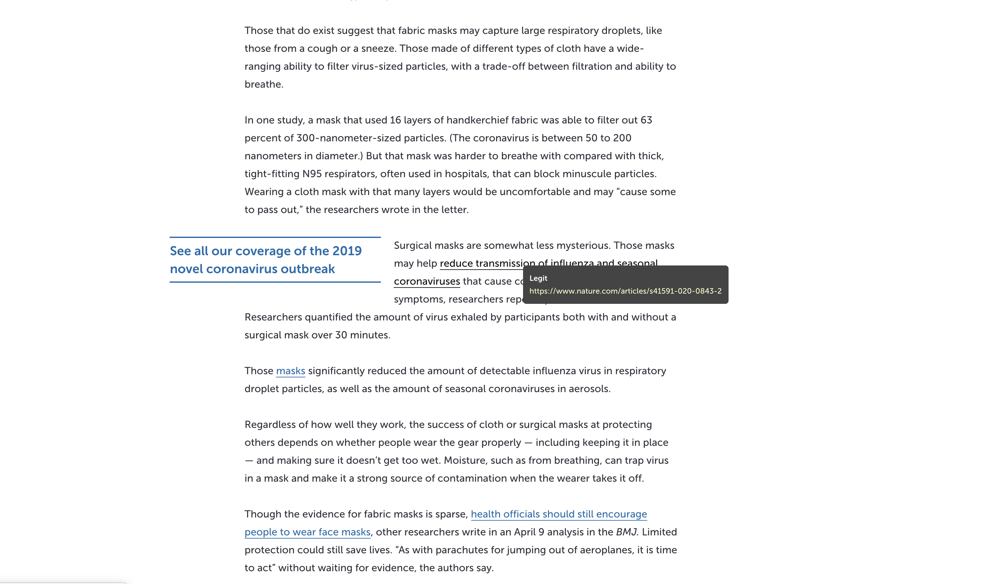

# SourceChecker

A Chrome extension that checks if links are associated with reputable science publications.

# Demo

# Thanks

- [spyon](https://github.com/eddieherm/spyon)
- [Spy](https://github.com/Wscats/spy)
- [filewhat](https://github.com/JohnLZeller/filewhat)

## License

Released under the MIT License.